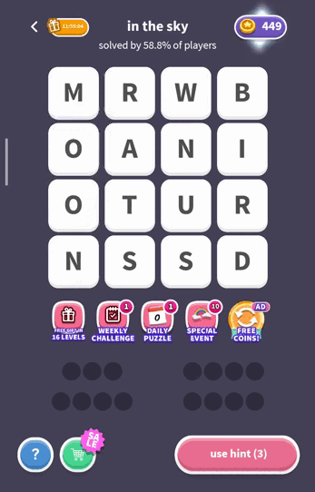
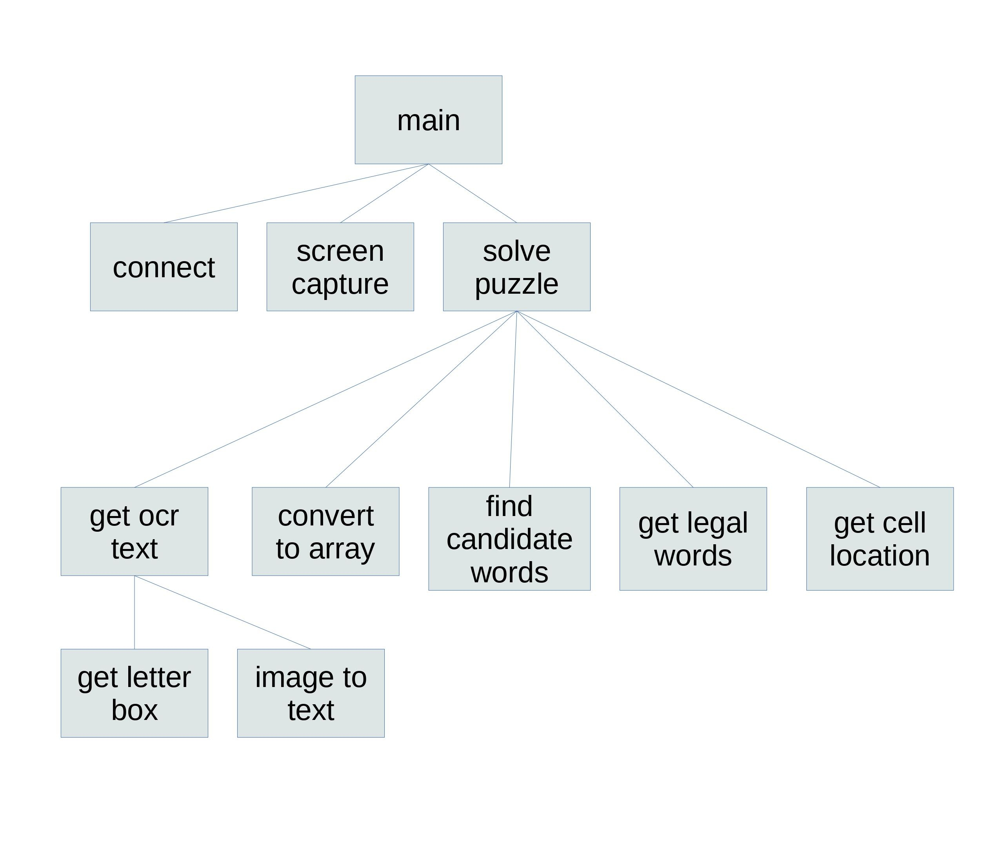
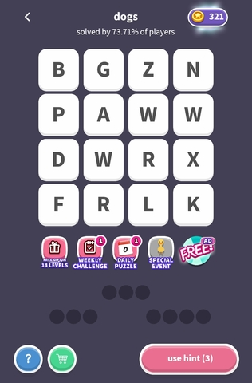
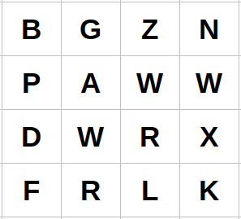
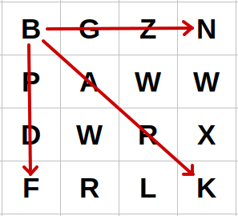
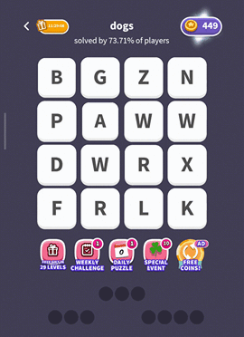

## How to build an Android bot

This project is a small demonstration of how to build a bot to play Android mobile games.

The target is a simple word game of the 'word search' variety, called Word Whizzle on Android. It's available in the Google Play store.  

Here's a brief clip showing the bot playing the game. 

The bot was developed using Python on a Linux platform.  I don't think there are any Linux dependencies, but I didn't test it anywhere else.  

I'm not a professional programmer and I'm new to Python so excuse me if I haven't followed Python conventions or style.

Also, this is just a demo, a prototype, that is not intended to be a robust or portable solution. It doesn't have any error handling and may require a bit of adjusting to get it to work with your specific model phone.

### Conceptual Overview

To build a bot for a word game, there are several key issues that must be addressed.

1. How to drive the phone, that is, to control it from a connected PC. 
2. How to read the screen and identify the letters in the puzzle.
3. Search for words in the grid of letters.
4. Given a word that could be part of the solution, determine the position of letters on the board, and then convert those board positions into screen coordinates.
5. Swipe the screen at the desired coordinates.

### Design Diagram

### Algorithm Walkthrough

##### Find the connected device

The connect function in PlayGame module uses the helpful ppadb module to make a connection with an attached Android device.

##### Identifying the Letters

The next step is to take a screen capture of the game board and identify the letters that are displayed.

Here's an example screen capture:

There are several good Python libraries for doing Optical Character Recognition (OCR), including EasyOCR and PyTesseract.

For this project we will use PyTesseract. (There are numerous tutorials on the web that can guide you through installing Tesseract and PyTesseract.) It would be great if we could just give a screenshot of the entire screen to the OCR engine
and have it find all the letters.  But there are some features of this screen (as in many games) that make it infeasible without some modifications.  The black lines between the cells are a big confusion factor for the OCR, and the letters 
are spaced much farther apart than they would in normal typeset text. So we'll have to perform some manipulation of the image before we send it to the OCR.  

These operations are performed by the function get_text_from_row. For each row of the puzzle, the function isolates the individual letter images, and then pastes them in a line so the spacing resembles normal text.  Thus,

 is converted into

Each merged row image is then sent to the image_to_text OCR function,  and the text that is identified is appended to a list.  
The output of the function is a list of text strings, for example `['BGZN','PAWW','DWRX','FRLK']`

Next, the convert_to_array function transforms the strings into a 4x4 grid, giving us a textual representation of the board.

##### Search for Words

Now that we have converted the image into a representation of the board, we need an algorithm that can follow the rules of the game to find a solution, in this case that means doing the word "search" of the letters in the board.

This simplest approach for us is to do an exhaustive search of all the possible legal letter combinations on the board. The find_candidate_words function considers every board position in turn, and for each position it considers the adjacent letters in each different direction.

In this example, the algorithm chooses the letter B in the upper left corner and then creates a string in each of the three directions shown, producing `"BGZ","BGZN","BAR","BARK","BPD",and "BPDF"`.

##### Find Legal Words

Next we filter this list of strings to find only those that are actual dictionary words. The Words module creates a list of dictionary words from an external file.  The get_legal_words function then checks each string we obtained from the board to see if it's in the dictionary.   For example, "BAR" and "BARK" are dictionary words.  The result is a list of legal words.  

##### Calculate Letter Coordinates

Eventually we are going to want to swipe each of these words on the phone.  For our specific game, not every word we found will be part of the solution, but we will try them all anyway. If we swipe a word that isn't part of the solution the game will just ignore it.  

To prepare for this step, we need to know the screen location for the letters in each word to be swiped.  Specifically, we want to swipe from the beginning to the end of the word, so we want to know the location of the first letter in the word and the location of the last letter in the word.  For example, to swipe the word "BARK" we need to know the location of the 'B' and the 'K'.

In the process of constructing the candidate list this information is available, so the find_candidate_words function saves these start and end positions along with each word it constructs. We refer to a start and end pair as a route.

##### Swipe the Word

The swiping is performed in the `for` loop in the PlayGame solve_puzzle function.  This loop takes each legal word and calls get_cell_location to compute the start and end points of the route, producing the coordinates needed for swiping.

Finally, an ADB shell command, "`input swipe`", is issued to carry out the swipe gesture on the phone screen.

### Adapting the code to other games

Modify the letter isolation and identification code.   Different games present the playing area in different ways so the mechanism for isolating the letters will need to be modified.   The 'psm' argument of PyTesseract can be changed for different scenarios.  Getting the OCR to perform accurately can involve a lot of custom fine-tuning.  

In this game, solving the puzzle used a simple exhaustive search.  Other games may require different algorithmic techniques.

Adjusting the timing.  To create a completely autonomous bot requires that the bot insert delays for animations that are presented as well as identifying when a level has been completed and other state changes in the game.  This requires a careful and detailed study all possible game states and transitions and implementing the required taps, delays, and swipes into the bot. 

